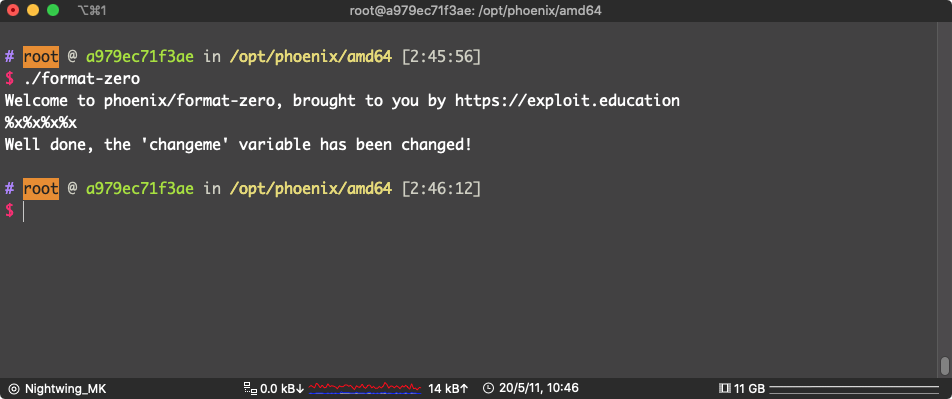
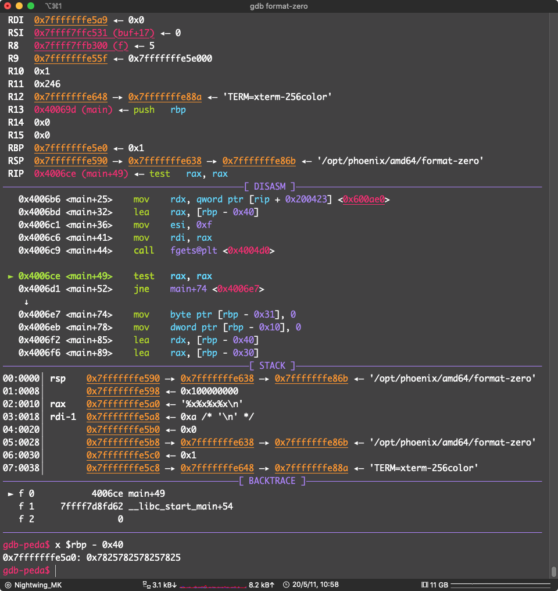
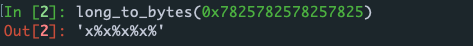
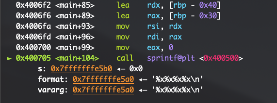
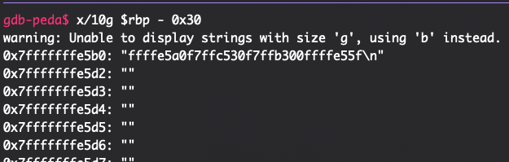
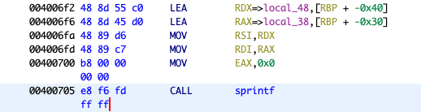
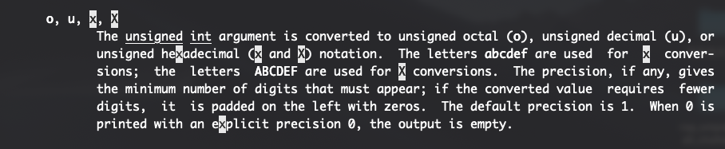
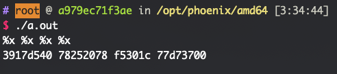

# FORMAT ZERO

This level introduces format strings, and how attacker supplied format strings can modify program execution.

**Hints**

- `man 3 printf`
- [Exploiting Format String Vulnerabilities](https://www.google.com/search?q=)

### Source code

```c
/*
 * phoenix/format-zero, by https://exploit.education
 *
 * Can you change the "changeme" variable?
 *
 * 0 bottles of beer on the wall, 0 bottles of beer! You take one down, and
 * pass it around, 4294967295 bottles of beer on the wall!
 */

#include <err.h>
#include <stdio.h>
#include <stdlib.h>
#include <string.h>
#include <unistd.h>

#define BANNER \
  "Welcome to " LEVELNAME ", brought to you by https://exploit.education"

int main(int argc, char **argv) {
  struct {
    char dest[32];
    volatile int changeme;
  } locals;
  char buffer[16];

  printf("%s\n", BANNER);

  if (fgets(buffer, sizeof(buffer) - 1, stdin) == NULL) {
    errx(1, "Unable to get buffer");
  }
  buffer[15] = 0;

  locals.changeme = 0;

  sprintf(locals.dest, buffer);

  if (locals.changeme != 0) {
    puts("Well done, the 'changeme' variable has been changed!");
  } else {
    puts(
        "Uh oh, 'changeme' has not yet been changed. Would you like to try "
        "again?");
  }

  exit(0);
}
```


这个要求就是:

```c
locals.changeme != 0
```

dest 有 32 Bytes 我们只能输入 16 Bytes，按道理来讲是不能溢出 dest 覆盖 changeme 的

但是，这里的 sprintf 用法有问题

```c
int sprintf(char *str, const char *format, ...);
```

这是函数原型

应该是有 3+ 个参数参数的但是这里

```c
 sprintf(locals.dest, buffer);
```

正常输入都是没有问题的 但是要是输入 的是 格式化字符串，那么 sprintf 就处理成格式化字符串

就会把栈上的东西读出来



这里就是输入了 4 个 %x

具体发生了什么，gdb 调式看看





输入了几个 %x

看看最终会往 dest 写入什么



可以看到，sprintf 把输入当成了 格式化字符串



可以看到并不是写入 `%x%x%x%x`

而是：`ffffe5a0f7ffc530f7ffb300ffffe55f`



看这个汇编，在调用 sprintf 的时候，把我们的输入既当成第二个参数也当成了第三个参数，第二个参数原本是格式化字符串的，输入格式化字符串的话它也会当成格式化字符串来处理而不是字符串

看 %x 的描述就知道为什么可以溢出 dest 了



*%x* 也是以16进制的形式输出内存地址。 

更直观的，我写了个 demo

```c
#include<stdio.h>

int main()
{
  char outbuf[32];
  char buf[16];
  fgets(buf, 15, stdin);
  sprintf(outbuf, buf);
  printf("%s\n", outbuf);
  return 0;
}
```

