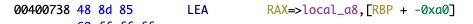
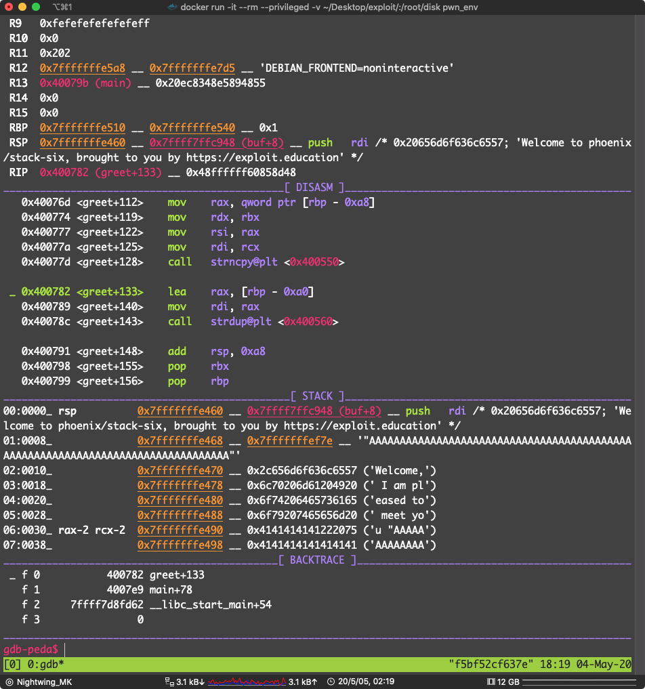

# STACK SIX

Where does Stack Six go wrong, and what can you do with it?

Depending on the architecture you’re doing this on, you may need to explore more and be creative with how to solve this level.

The macro GREET is architecture dependent.

v1.0.0-alpha-2 note: AMD64 and i486 are known working, though ARM64 and ARM may not currently be solvable.

### Source code

```c
/*
 * phoenix/stack-six, by https://exploit.education
 *
 * Can you execve("/bin/sh", ...) ?
 *
 * Why do fungi have to pay double bus fares? Because they take up too
 * mushroom.
 */

#include <err.h>
#include <stdio.h>
#include <stdlib.h>
#include <string.h>
#include <unistd.h>

#define BANNER \
  "Welcome to " LEVELNAME ", brought to you by https://exploit.education"

char *what = GREET;

char *greet(char *who) {
  char buffer[128];
  int maxSize;

  maxSize = strlen(who);
  if (maxSize > (sizeof(buffer) - /* ensure null termination */ 1)) {
    maxSize = sizeof(buffer) - 1;
  }

  strcpy(buffer, what);
  strncpy(buffer + strlen(buffer), who, maxSize);

  return strdup(buffer);
}

int main(int argc, char **argv) {
  char *ptr;
  printf("%s\n", BANNER);

#ifdef NEWARCH
  if (argv[1]) {
    what = argv[1];
  }
#endif

  ptr = getenv("ExploitEducation");
  if (NULL == ptr) {
    // This style of comparison prevents issues where you may accidentally
    // type if(ptr = NULL) {}..

    errx(1, "Please specify an environment variable called ExploitEducation");
  }

  printf("%s\n", greet(ptr));
  return 0;
}
```


干活


看到 `main` 函数没有什么特别的

```c

undefined8 main(void)

{
  char *__s;
  
  puts("Welcome to phoenix/stack-six, brought to you by https://exploit.education");
  __s = getenv("ExploitEducation");
  if (__s == (char *)0x0) {
    errx(1,"Please specify an environment variable called ExploitEducation");
  }
  __s = (char *)greet(__s);
  puts(__s);
  return 0;
}
```

就是 把环境变量 `ExploitEducation` 读进 `__s` 里面，我们不可能通过 `__s` 覆盖返回地址

因为：

```asm
   0x4007b4 <main+25>    mov    edi, 0x4008c2
   0x4007b9 <main+30>    call   getenv@plt <0x400520>

 ► 0x4007be <main+35>    mov    qword ptr [rbp - 8], rax
```

看到这个汇编了吗 `__s` 是存在别的地方的（其实是存在 `bss` 段）

`gdb` 调式看看


可以看到 `__s` 并不是存在栈上的


看到 `rbp - 8` 存的是一个地址 这个地址指向的那块内存存的是我们设定的 `ExploitEducation` 的值（ `rax` 在这里存的是  `getenv` 的返回值）所以这里不存在栈溢出。

获取环境变量 `ExploitEducation` 的值后存进 `__s` 

```
__s = (char *)greet(__s);
```

再把 `__s` 传进 `greet` 函数里面


```c

void greet(char *param_1)

{
  size_t sVar1;
  size_t __n;
  char local_a8 [140];
  uint local_1c;
  
  // 获取我们窜进来的字符串 param_1 的长度
  sVar1 = strlen(param_1);
  local_1c = (uint)sVar1;
  // 如果传进来的字符串长度大于 0x7f（127） sVar1 就设定为  0x7f（127）
  if (0x7f < local_1c) {
    local_1c = 0x7f;
  }
  // 把 what 拷贝进 local_a8 里面
  strcpy(local_a8,what);
  // __n 其实就是取了 sVar1 的值（自己看汇编）
  __n = SEXT48((int)local_1c);
  // 获取 local_a8 这个 buffer 的大小
  sVar1 = strlen(local_a8);
  // 截取 param_1 的长度 __n 放到 local_a8 + sVar1 的位置，其实漏洞点就在这里
  strncpy(local_a8 + sVar1,param_1,__n);
  strdup(local_a8);
  return;
}
```

通过分析

```c
strncpy(local_a8 + sVar1,param_1,__n);
```

这里会发生溢出

因为：可以看到 前面的 `strcpy(local_a8,what);` 已经把 `what` 指向的字符串拷进了  `local_a8` 里面，至于这个字符串是什么，可以看到 `strdup();`  查了一下，就是 返回了 `local_a8` 的地址


然后在 `main` 函数里面打印出来


看到了吗，程序打印了 

Welcome to phoenix/stack-six, brought to you by https://exploit.education
Welcome, I am pleased to meet you test

我的 `ExploitEducation="test"` 说明了 what 就是 Welcome, I am pleased to meet you 

直接 gdb dump 出来


看到了吗：what = "Welcome, I am pleased to meet you "


仔细看 you 后面还有一个空格

这个字符串的长度是 `34` 

这个函数做的第一步

```c
strcpy(local_a8,what);
```

就是把 `Welcome, I am pleased to meet you ` 复制进 `local_a8`

然后

```
strncpy(local_a8 + sVar1,param_1,__n);
```

又把 `param_1` 的前面 `__n` 个字符复制进 `local_a8 + sVar1` 

仔细看，其实这里的  `__n`  就是 `0x7f(127)` 

也就是说我们一共可以往 `local_a8` 写入 `127 + 34 = 161`  个字符


从这里可以看到 `local_a8` 位于 `RBP + -0xa0` 也就是 距离 `rbp` 0xa0(160) 


思维进入死胡同，未完成!!!!

二进制文件和 libc.so 我已经上传 位于 bin 文件夹内


有人解出来了告诉我一下


现在是 2010-05-05 01：37：27

之前我想破脑袋也想不出来，在能控制 rbp 最低一个 Byte 怎么能在有 ASLR 的情况下泄露出输入的内容的地址

我现在才想起来，官方给的环境是不开 ASLR 的，cao

这就简单多了，其实可以吧 shellcode 放到输入的开头，没有 ALSR 的情况下，在 greet 里面 rbp 的值是不会变的，只要拿 rbp 的值的最后一个 Byte 加上 local_a8 在栈上的偏移量，只要不超过 0xff ，把这个值盖到 rbp 的最低一位，在 leave 函数执行 `


这个 buffer 是放在栈上的，也就是：



它距离 rbp 是 0xa0

只要知道 rbp 的值就能计算



rbp 的值是：`0x7fffffffe510`

最低一位是 0x10 加上 local_a8 的偏移量 0xa0 ，等于 ：0xb0

只要把 rbp 的最低一个字节覆盖成 0xb0 ，rbp 存的就是我们输入的东西的地址

在函数返回时：

```asm
   0x400791 <greet+148>    add    rsp, 0xa8
   0x400798 <greet+155>    pop    rbx
   0x400799 <greet+156>    pop    rbp
   0x40079a <greet+157>    ret
```

把 rsp 加 0xa8

pop rbx

pop rbp

其实就是把 `0x7fffffffe5b0` 放进 rbp

然后，返回 main 函数

在 main 函数里面有：

```
   0x4007f1       <main+86>    mov    eax, 0
   0x4007f6       <main+91>    leave
   0x4007f7       <main+92>    ret
```

这个 leave 指令相当于

` mov rsp,rbp`

`ret` 相当于 `pip rip` 从栈上拿一个地址，然后跳到那里去执行